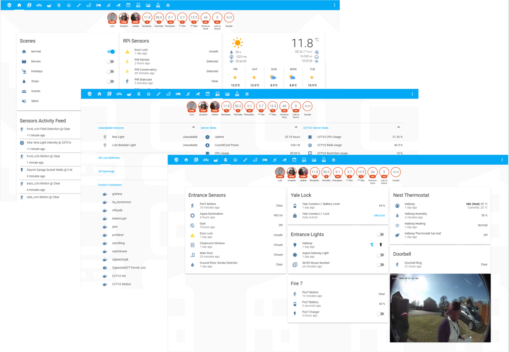

# Home Assistant Configuration

My [Home Assistant](https://home-assistant.io/) Configuration Files

## Inspiration

- [Teagan42](https://github.com/Teagan42/HomeAssistantConfig)

## Devices

- HP ProLiant N54L MicroServer (Main server with Home-Assistant)
- Raspberry Pi Model B (for motion sensors, photoresistor sensor, BME280 Temperature and Barometer Sensor)
- Raspberry Pi 3 Model B (Kodi)
- Raspberry Pi 3 Model B (Smart Calendar Display with [MagicMirror](https://github.com/MichMich/MagicMirror))

- Aeotec Z-Stick Gen5
- Amazon Fire7 (used as an alarm keypad with [Fully Kiosk](https://fully-kiosk.com), and used as motion detection, CCTV)
- Amazon Fire Stick 4K
- Anova Precision Spous-Vide Smart Cooker
- AOK Smart Blinds Motor
- ~~BME280 Temperature and Barometer Sensor~~
- ~~Byron SX-20T Doorbell~~
- CC2531 flashed with [Zigbee2mqtt](https://www.zigbee2mqtt.io/)
- [Cresta TS34C](https://www.conrad-electronic.co.uk/ce/en/product/672148/5-Channel-TS34C-Wireless-Thermo-Hygro-Sensor) Hygrometers
- CurrentCost EnviR Energy Monitor & IAM Energy Monitors
- [Edimax SP-2101W](https://www.amazon.co.uk/Edimax-Switch-Intelligent-Energy-Management/dp/B00T647F2C/)
- ESP32 with [WLED](https://github.com/Aircoookie/WLED)
- Google ChromeCast Audio
- Google Home Mini
- Hikvision DS-2CD2142FWD-I and DS-2CD2355FWD-I Cameras
- Hikvision DS-KB6403-WIP Doorbell
- H801 LED Strip Controllers
- HomeEasy HE305 Contact Sensors
- HomeEasy HE830 Sockets
- [Houzetek SWA1](https://www.houzetek.com/product-wifi-smart-plug-uk) socket controlled via Tuya
- iPhone 7, Xs, 11 Pro
- iPad Air 2
- [Kello](https://www.getkello.com/) Smart Alarm
- Kerui J008 Strobe Sirens in Yale Dummy Box
- Kerui RC531 Remote Control
- LightWaveRF [Switches](https://lightwaverf.com/products/smart-dimmer-2-gang?variant=16341551480921) & [Sockets](https://lightwaverf.com/products/basic-remote-on-off-socket-kit)
- Nest V3 Thermostat
- Onkyo TX-NR656 AV Amplifier
- Panasonic TX58DX700 TV
- RFXCOM RFXtrx433 433MHz transceiver
- Rollerhouse Smart Blinds Motor
- Sky+HD Box
- Sonoff Basic with [Tasmota](https://github.com/arendst/Sonoff-Tasmota) firmware
- Tile Mate, Slim trackers
- Verint S5003FD Camera
- Wemos D1 Mini Pro
- Xiaomi Aqara V3 Gateway
- Xiaomi Aqara Sensors (Hygro, window/door)
- Xiaomi DaFang Cameras with [Dafang Hacks](https://github.com/EliasKotlyar/Xiaomi-Dafang-Hacks)
- Xiaomi Mi Bluetooth V4.0 Body Composition Smart Scale
- Xiaomi Mi Box 3
- Xiaomi Mi Flora Plant Sensor
- Xiaomi Mi Robot Vacuum V1
- Xiaomi Mijia Honeywell Fire Alarm Detector
- Xiaomi Mijia Enhanced Version Dual USB Smart Socket
- Xiaomi Mijia Zigbee Smart Socket
- Xiaomi Philips Zhirui Candle Light
- Xiaomi Router R3P Pro
- Xiaomi XiaoFang Camera with [Dafang Hacks](https://github.com/EliasKotlyar/Xiaomi-Dafang-Hacks)
- Yale Conexis L1 Smart Lock

## View of my Home Assistant UI
